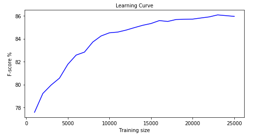
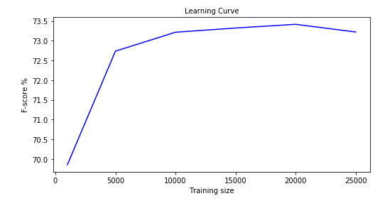
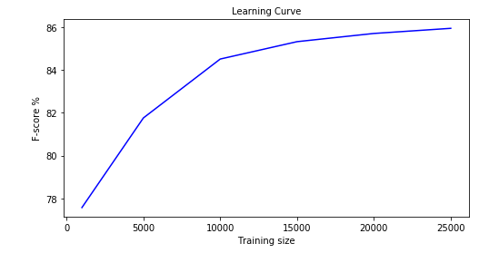

😂😁😐 Sentiment analysis of IMDB movie reviews 😞😠😤
---

This project conducts sentiment analysis on the `Large Movie Review Dataset v1.0` (Mass et al., 2011) which contains 100,000 reviews extracted from the IMDB movie review website. The dataset used in this repo can be downloaded from the original source here. http://ai.stanford.edu/~amaas/data/sentiment/

### The dataset:

The core dataset contains `50,000` reviews split evenly into `25,000` train
and `25,000` test sets. The overall distribution of labels is balanced (25k
pos and 25k neg). There is an additional `50,000` unlabeled
documents for unsupervised learning.

In the entire collection, no more than `30` reviews are allowed for any
given movie because reviews for the same movie tend to have correlated
ratings. Further, the train and test sets contain a disjoint set of
movies, so no significant performance is obtained by memorizing
movie-unique terms and their associated with observed labels.  In the
labeled train/test sets, a negative review has a score `<= 4` out of `10`,
and a positive review has a score `>= 7` out of `10`. Thus reviews with
more neutral ratings are not included in the train/test sets. In the
unsupervised set, reviews of any rating are included and there are an
even number of reviews `>5` and `<=5`.

## Run instructions
Install the required packages
```
pip3 install -U scikit-learn
pip3 install paramiko
pip3 install gensim
```
Run the notebook and execute the cells in question
```
jupyter notebook analysis.ipynb
```

## Analysis performed:

#### WordCounds (BagOfWords) and logistic regression

This can be found in §4 of the analysis notebook. The vectorization algorithm (CountVectorizer) was trained on the full dataset and 1000 most common words were extracted. Below is a plot of the learning curve against the training size.

<p align="center">
  
</p>

Suprisingly, with only `1000` training samples the model achieved a F1-score of `77.6%` while with `5,000` training samples the model achieved an accuracy of `81.8%`. Nevertheless, this is to be expected because the more training examples we have, the better the generalization to the unseen test.

#### Interactions between training size and feature size

I hypothesized that the size of the training only improves the learning model if the size of the feature space is large enough (vocabulary). I tested this by running the logistic model over different feature sizes `[100, 1000,10000]` and investigated the performance profile over the training set with varying lengths. Below are the results.

<p align="center">
  
  
</p>

(Left) 100 features, (Right) 1000 features

With `100` features, the model quickly learned the most optimal parameters. After `5000`-`10000` training examples, the model did not improve the score. Furthurmore, this score actually dropped after `20,000+` instances suggesting either overfitting or lack of features to search over since the feature space is so constrained. With `1000` features the model continually improved even after `25000` examples.

#### Vectorization with CV/TF-ID and training with MultinomialNaiveBayes/LogisticRegression


#### Building a Word2Vec model for sentiment analysis

Word2Vec [2] is a tool that inputs a text corpora and produces word vectors as outputs. It builds a vocabulary from training text and learns optimal vector representations of words. The cosine of the word vectors can give us the relationship and distances between words. The resulting vector representations can also be used as input features in other NLP and ML applications. Interestingly, the word vectors can capture many latent linguistic information for example. `king - man + woman` is most likely queen

More information on the model can be found here https://arxiv.org/pdf/1301.3781.pdf

We build a Word2Vec sentiment analysis model on our IMDB dataset.

#### Building a Doc2Vec model

Doc2Vec [3] is tool for representing documents as vectors. It builds upon the Word2Vec model and extends it. Traditional linguistic models use "bag of words" sentence level features. When it comes to texts, the most common problem is that those models lose the ordering of words. Doc2Vec proposes a paragraph-level unsupervised algorithm for learning fixed-length feature representations from variable-length text. The algorithm produces a dense vector that is trained to predict words in the document.

Furthur details can be found here: https://cs.stanford.edu/~quocle/paragraph_vector.pdf

This project uses the [Gensim package implementation of Doc2Vec](https://radimrehurek.com/gensim/models/doc2vec.html), specifically, [Scikit-learn wrapper for it in Gensim](https://radimrehurek.com/gensim/sklearn_api/d2vmodel.html). We start we an example of how to train a Doc2Vec model and use it in a sentiment analyzer. Then we studying Doc2Vec's behavior under different settings.


## References

---
1. [IMDB] A.L.Maas,  R.E.Daly,  P.T.Pham,  D.Huang, A.Y.Ng,  and C.Potts,  “Learning word  vectors  for  sentiment  analysis,”  in Proceedings of the 49th Annual Meeting of the Association for Computational Linguistics: Human Language Technologies. Portland, Oregon,

2. [Word2Vec] Mikolov, T., Chen, K., Corrado, G.S., & Dean, J. (2013). Efficient Estimation of Word Representations in Vector Space. CoRR, abs/1301.3781.

3. [Doc2Vec] Quoc Le and Tomas Mikolov. 2014. Distributed representations of sentences and documents. In Proceedings of the 31st International Conference on International Conference on Machine Learning - Volume 32 (ICML'14), Eric P. Xing and Tony Jebara (Eds.), Vol. 32. JMLR.org II-1188-II-1196.
